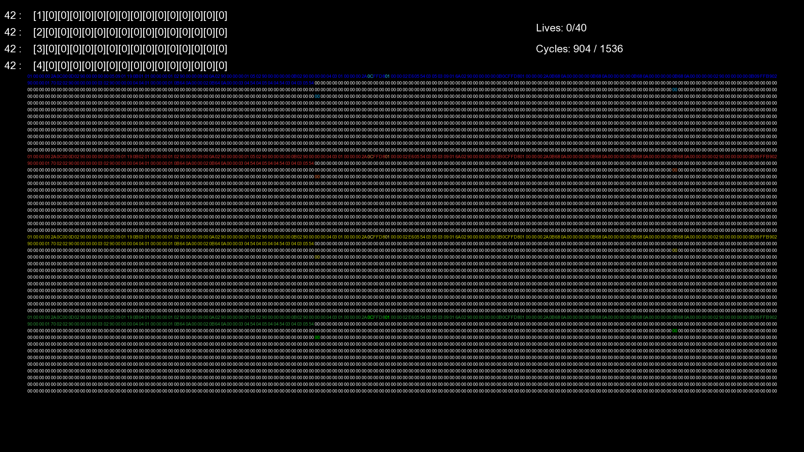

<h1 align="center">Corewar</h1>

---

 Final Project of Epitech 1st Year
      

## What's Corewar ?

 

The Corewar is the final project of the first year at Epitech, the goal of this project 
is to realise a Virtual Machine and an ASM Compiler to compile ***.s*** in ***.cor***, 
and we can do some bonus to have better mark 

## Our bonus

 

We decide to add a graphical Virtual Machine to see exactly all the procesus. 
Each little square on the picture below represent a byte, and each color a champions 

  

 

## To Finish

 

To close this module, we have to do a complete presentation of the project and explain how we do this project ! 
At the end of the presentation we get a third better mark, and in a second time we do a technical review to expose our 
code and present all functionality of our project. In conclusion we get a grade from E to A for this module.

        Presentation mark:      4240

        Technical review mark:  14/20

        Grade:                  A

        We get the third best mark of our Promotion.

 

## Credits

 

### **Thomy Lorenzatti** https://github.com/ThomyLorenzatti  
### **Hugo Nini** https://github.com/Carpetic  
### **William Piloz** https://github.com/WilliamPiloz  
